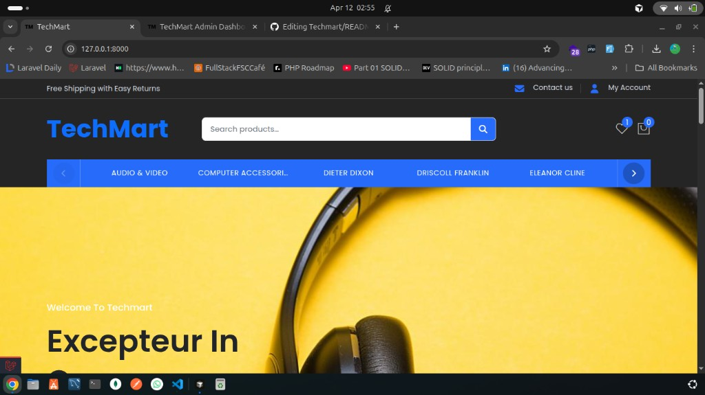
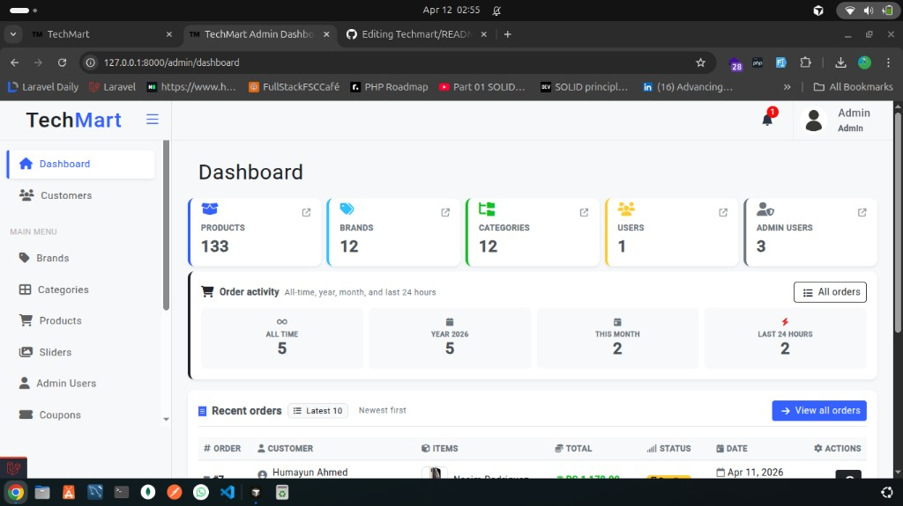

# TechMart

An e-commerce store with a customer-facing site and an admin panel. This project is built with **Laravel**, **Bootstrap**, and **JavaScript**. Front-end assets are compiled with **Vite** when you develop or build for production.

## Screenshots

**Storefront** — home page with search, categories, and hero banner.



**Admin dashboard** — overview stats, orders, and sidebar navigation.



## What you need installed

- **PHP** 8.2 or newer  
- **Composer**  
- **Node.js** (LTS, e.g. 18 or 20) and **npm**  
- **MySQL** or **MariaDB**  

PHP should include common extensions such as `openssl`, `pdo_mysql`, `mbstring`, `json`, `fileinfo`, and `gd` (for images).

## Run the project on your computer

**1. Get the code**

```bash
git clone <your-repo-url> techmart
cd techmart
```

**2. Install PHP packages**

```bash
composer install
```

**3. Set up the environment**

```bash
cp .env.example .env
php artisan key:generate
```

Open `.env` and set your database details (`DB_DATABASE`, `DB_USERNAME`, `DB_PASSWORD`) and `APP_URL` (for local use, `http://127.0.0.1:8000` is fine).

Create an empty database in MySQL, for example:

```sql
CREATE DATABASE techmart CHARACTER SET utf8mb4 COLLATE utf8mb4_unicode_ci;
```

**4. Create the database tables**

```bash
php artisan migrate
```

**5. (Optional) Sample admin and settings**

```bash
php artisan db:seed
```

After seeding, the admin login is **admin@gmail.com** / **password**. Change this password if the app is not only on your own machine.

**6. Public storage link**

```bash
php artisan storage:link
```

**7. Install and build front-end assets**

```bash
npm install
npm run build
```

**8. Start Laravel**

```bash
php artisan serve
```

Open **http://127.0.0.1:8000** in your browser. Admin area: **http://127.0.0.1:8000/admin**.

## Development mode (Vite + Laravel)

While you are changing CSS or JavaScript, run two terminals:

**Terminal 1 — Laravel**

```bash
php artisan serve
```

**Terminal 2 — Vite (live reload for assets)**

```bash
npm run dev
```

Keep `APP_URL` in `.env` the same as the address you use in the browser (for example `http://127.0.0.1:8000`).

---

## Google login (OAuth)

The login page links to Google. These routes are used:

- Start login: `/auth/google` (`auth.google`)
- After Google redirects back: `/auth/google-callback` (`auth.google.callback`)

### 1. Create credentials in Google Cloud

1. Open [Google Cloud Console](https://console.cloud.google.com/) and select or create a project.
2. Go to **APIs & Services → OAuth consent screen**. Choose **External** (unless you use Google Workspace internally), fill the app name and your contact email, add scopes if prompted (email and profile are enough for Socialite), add test users while the app is in testing.
3. Go to **APIs & Services → Credentials → Create credentials → OAuth client ID**.
4. Application type: **Web application**.
5. **Authorized JavaScript origins** — add your site origin only (no path), for example:
   - Local: `http://127.0.0.1:8000`
   - Production: `https://yourdomain.com`
6. **Authorized redirect URIs** — must match the callback route exactly, for example:
   - Local: `http://127.0.0.1:8000/auth/google-callback`
   - Production: `https://yourdomain.com/auth/google-callback`
7. Save and copy the **Client ID** and **Client secret**.

### 2. Add values to `.env`

Use the **full callback URL** (same string you entered as a redirect URI) for `GOOGLE_CALLBACK_REDIRECTS`:

```env
GOOGLE_CLIENT_ID=your-client-id.apps.googleusercontent.com
GOOGLE_CLIENT_SECRET=your-client-secret
GOOGLE_CALLBACK_REDIRECTS=http://127.0.0.1:8000/auth/google-callback
```

On production, change `APP_URL` and these values to your real HTTPS domain.

### 3. Clear config cache (if you use it)

```bash
php artisan config:clear
```

Users who sign in with Google get `email_verified_at` set automatically. Users who register with email and password must verify by email before they can open the **dashboard** (see below).

---

## Stripe (card payments at checkout)

Checkout supports **cash on delivery** without Stripe. **Card** payments use Stripe test or live keys.

### 1. Stripe account and API keys

1. Sign up or log in at [Stripe Dashboard](https://dashboard.stripe.com/).
2. Turn on **Test mode** while developing.
3. Go to **Developers → API keys**.
4. Copy the **Publishable key** and **Secret key**.

### 2. Add keys to `.env`

```env
STRIPE_KEY=pk_test_...
STRIPE_SECRET=sk_test_...
```

For live payments, use `pk_live_...` and `sk_live_...` and deploy only over HTTPS.

### 3. Behaviour in this project

- Charges are created in **PKR** (Pakistani rupees). Your Stripe account must be able to charge in that currency, or you will need to change the currency in `app/Http/Controllers/CheckoutController.php` to match your Stripe settings.
- The checkout page loads Stripe.js and creates a **card token** before placing the order. Use Stripe [test cards](https://docs.stripe.com/testing) (for example `4242 4242 4242 4242`) in test mode.

### 4. After changing `.env`

```bash
php artisan config:clear
```

---

## Email and email verification

### How verification works here

- New accounts created with **email and password** receive a **verification email** after registration. The **dashboard** route uses Laravel’s `verified` middleware, so unverified users are redirected to the verification screen until they click the link in the email.
- **Google sign-in** sets the email as verified in code, so those users are not asked to verify again.
- If a user **changes their email** in the profile, the app can clear verification so they must verify the new address (same mail setup must work for the new link).

### 1. Mail settings in `.env`

Set a real mail transport for production. Examples:

**A. Log only (local debugging)** — no inbox; content is written to Laravel’s log (you can copy the verification URL from `storage/logs/laravel.log`):

```env
MAIL_MAILER=log
MAIL_FROM_ADDRESS="noreply@yourdomain.com"
MAIL_FROM_NAME="${APP_NAME}"
```

**B. SMTP (typical shared host or custom server)**

```env
MAIL_MAILER=smtp
MAIL_HOST=mail.yourdomain.com
MAIL_PORT=587
MAIL_USERNAME=your_smtp_user
MAIL_PASSWORD=your_smtp_password
MAIL_ENCRYPTION=tls
MAIL_FROM_ADDRESS="noreply@yourdomain.com"
MAIL_FROM_NAME="${APP_NAME}"
```

**C. Gmail-style SMTP** — often requires an [app password](https://support.google.com/accounts/answer/185833) if 2FA is on; Google may block “less secure” sign-in.

Use the **same** `MAIL_FROM_ADDRESS` domain or reputation that your provider allows, or messages may go to spam.

### 2. `APP_URL` must be correct

Verification links are built using your application URL. Set:

```env
APP_URL=http://127.0.0.1:8000
```

(or your production `https://...` URL). Wrong `APP_URL` produces broken links in emails.

### 3. Queue worker (recommended when mail is queued)

This project’s `.env.example` uses `QUEUE_CONNECTION=database`. If notifications or mail are processed on the queue, run:

```bash
php artisan queue:work
```

Keep this running in production (supervisor, systemd, or your host’s queue tool) so order emails and similar messages are sent. If you set `QUEUE_CONNECTION=sync`, jobs run during the web request and you do not need a worker (not ideal under heavy load).

### 4. Resend verification email

Logged-in users who have not verified can use the “resend verification email” action on the verification page (route `verification.send`, throttled).

---

## License

This project is licensed under the [MIT license](https://opensource.org/licenses/MIT).
