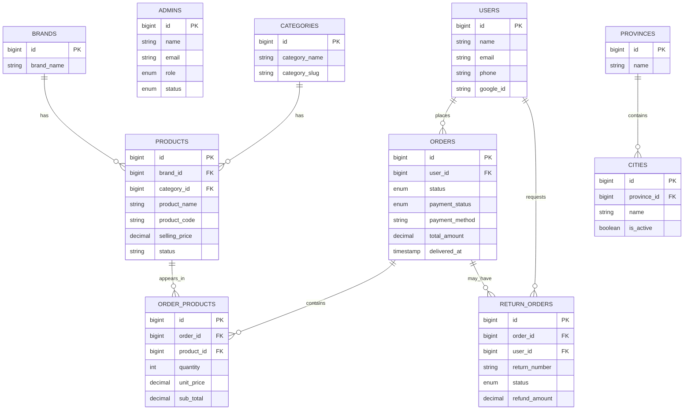

# TechMart

E-commerce storefront plus admin panel, built with **Laravel**, **Bootstrap**, **JavaScript**, and **Vite** for front-end builds.

## Screenshots

**Storefront**


**Admin dashboard**


## Database ER Diagram

The diagram below reflects the core e-commerce schema from the Laravel migrations.



## What you need

- PHP **8.2+**
- Composer
- Node.js (**18+** or **20+**) and npm
- MySQL 

## Run it locally

1. **Clone and install**

   ```bash
   git clone <your-repo-url> techmart
   cd techmart
   composer install
   ```

2. **Environment**

   ```bash
   cp .env.example .env
   php artisan key:generate
   ```

   In `.env`, set `DB_DATABASE`, `DB_USERNAME`, `DB_PASSWORD`, and `APP_URL` (e.g. `http://127.0.0.1:8000`).

3. **Database and storage**

   ```bash
   php artisan migrate
   php artisan storage:link
   ```

4. sample admin and settings:

   ```bash
   php artisan db:seed
   ```

   Default admin: **admin@gmail.com** / **password** (change this outside local dev).

5. **Front end**

   ```bash
   npm install
   npm run build
   ```

6. **Start the app**

   ```bash
   php artisan serve
   ```

   - Site: **http://127.0.0.1:8000**  
   - Admin: **http://127.0.0.1:8000/admin**

## Development (Vite + Laravel)

Run both at once:

```bash
php artisan serve
```

```bash
npm run dev
```

Keep `APP_URL` in `.env` the same as the URL you open in the browser.

## Google login (optional)

Routes: `/auth/google` → Google → `/auth/google-callback`.

1. In [Google Cloud Console](https://console.cloud.google.com/), create an **OAuth 2.0 Web client**.
2. **Authorized JavaScript origins:** e.g. `http://127.0.0.1:8000` (no path).
3. **Authorized redirect URIs:** e.g. `http://127.0.0.1:8000/auth/google-callback` (must match exactly).

Add to `.env`:

```env
GOOGLE_CLIENT_ID=...
GOOGLE_CLIENT_SECRET=...
GOOGLE_CALLBACK_REDIRECTS=http://127.0.0.1:8000/auth/google-callback
```

Then: `php artisan config:clear`

Google users are marked verified automatically. Email/password users still need email verification for the dashboard.

## Stripe (optional)

COD works without Stripe. For cards, add test keys from [Stripe Dashboard](https://dashboard.stripe.com/) → Developers → API keys:

```env
STRIPE_KEY=pk_test_...
STRIPE_SECRET=sk_test_...
```

Then: `php artisan config:clear`

This app charges in **PKR**. To use another currency, change it in `CheckoutController`. In test mode, use [Stripe test cards](https://docs.stripe.com/testing) (e.g. `4242 4242 4242 4242`).

## Email and verification

- Registering with **email + password** sends a verification link; **Dashboard** requires a verified email.
- Set **`APP_URL`** correctly so links in emails work.
- For local testing, `MAIL_MAILER=log` writes mail to `storage/logs/laravel.log` (you can copy the verify URL from there).
- For real mail, use **SMTP** in `.env` (`MAIL_MAILER=smtp`, host, port, user, password, `MAIL_FROM_ADDRESS`, etc.).
- With `QUEUE_CONNECTION=database`, run `php artisan queue:work` so queued mail (e.g. orders) actually sends.

Unverified users can resend the verification email from the verify page.
